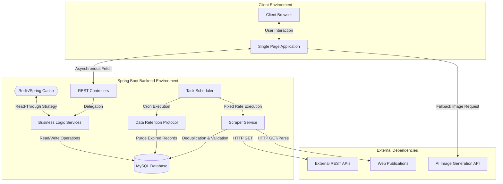

# System Architecture & Technology Flow

GlobalPulse implements a robust, multi-tiered architecture that strictly isolates data ingestion, business logic, persistence, and presentation layers. This separation of concerns ensures scalability, maintainability, and high performance across the application lifecycle.

## 1. Technology Stack

- **Frontend Environment**: HTML5, Vanilla JavaScript (ES6+), Bootstrap 5 UI Framework.
- **Backend Application**: Java 17, Spring Boot 3.x (Spring Web, Spring Data JPA, Spring Security, Spring Cache).
- **Relational Database**: MySQL 8.0.
- **Security & Identity**: JSON Web Token (JWT) based authentication.
- **Data Acquisition**: Jsoup (HTML Parsing) and RestTemplate (REST API Integration).
- **Dynamic Asset Generation**: Pollinations.ai API for fallback imagery.

## 2. Technology Flow Diagram

The following Mermaid diagram details the end-to-end data lifecycle within the GlobalPulse system, from external ingestion to client delivery.

## 3. Component Breakdown

### 3.1. Data Ingestion Layer
The application utilizes Spring's `@Scheduled` annotation to orchestrate background data collection. The `ScraperService` manages concurrent execution of various `NewsScraper` implementations. Prior to persistence, the service enforces deduplication by verifying article titles against existing database records via the `existsByTitle` repository method, ensuring high data integrity.

### 3.2. Persistence and Caching Layer
Validated articles are persisted in the MySQL database using Spring Data JPA. To mitigate database load during high-concurrency read operations (e.g., retrieving trending or recent articles), the `NewsService` employs Spring's `@Cacheable` abstraction. A scheduled cleanup routine automatically purges records exceeding the 30-day retention policy, optimizing storage and query performance.

### 3.3. Presentation Layer
The client application is a decoupled Single Page Application (SPA). It communicates with the backend REST APIs via asynchronous `fetch` operations. The client maintains an internal memory cache to reduce redundant network requests during pagination. In scenarios where source data lacks an image URI, the client dynamically constructs a request to the Pollinations.ai API using the article's unique identifier and categorical classification to generate a contextually relevant fallback image.
